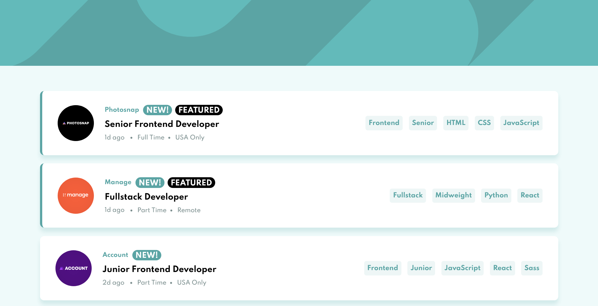

# Frontend Mentor - Job listings with filtering solution

This is a solution to the [Job listings with filtering challenge on Frontend Mentor](https://www.frontendmentor.io/challenges/job-listings-with-filtering-ivstIPCt).

## Table of contents

- [Overview](#overview)
  - [The challenge](#the-challenge)
  - [Screenshot](#screenshot)
  - [Links](#links)
- [My process](#my-process)
  - [Built with](#built-with)
  - [What I learned](#what-i-learned)
- [Author](#author)

## Overview

### The challenge

Users should be able to:

- View the optimal layout for the site depending on their device's screen size
- See hover states for all interactive elements on the page
- Filter job listings based on the categories

### Screenshot

### Links

- Solution URL: [CLick here to see the code](https://github.com/Beats-Ayush/job-listings)
- Live Site URL: [Click here to get to live site](https://beats-ayush-jobs-listing.netlify.app/)

## My process

### Built with

- Semantic HTML5 markup
- CSS custom properties
- Flexbox
- CSS Grid
- Mobile-first workflow
- [React](https://reactjs.org/) - JS library
- [Sass](https://sass-lang.com/) - For Styles

### What I learned

Learnt some advanced React concepts like global state management.

## Author

- Frontend Mentor - [@Beats-Ayush](https://www.frontendmentor.io/profile/Beats-Ayush)
- Github - [Beats-Ayush](https://github.com/Beats-Ayush)
